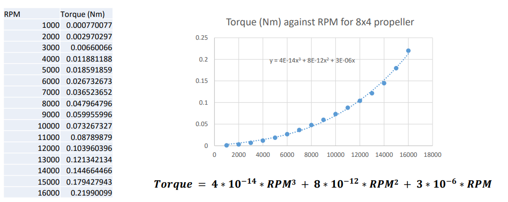

# DJI-Mavic-pro-simlified-modelling-and-simulation 
Th objectives of this project are to establish the mathematical model and the physics behind a four propeller drone modelled after the DJI Mavic Pro, design a SIMULINK model simulating the complete dynamics of the drone as well as location and gusts and finally, design and implement a PID controller to control its position and attitude. 
## The simplified DJI Mavic pro 

## The components to be modeled 

## The Foces at play 

## The complete model Diagram

## Battery and Motors limit

We assume that : 
- The Mavic Pro’s battery consists in three high discharge capacity Lithium-Polymer cells mounted in Series.
- Each cell has an average capacity of 3830mAh and a nominal voltage of 3.8V.
- Its total capacity is 43.6Wh for a weight of about 240g.
- The nominal battery voltage: 𝑉 = 3.8 ∗ 3 = 11.4V 
- maximum discharge capacity is 20C (staying conservative): I = 3.830 ∗ 20 = 77A
Thus, the max operating voltage which we will take as 11.4V to consider an average over one battery discharge, and a max current of 77A. 

## Emperical modelling of the DC motors
We assume a 0% RPM drop from KV at 0V and a 25% RPM drop from KV at max voltage: 11.4V. The RPM equation (with loading assumption) can be extracted by fitting a trend line to the data using Excel: 

## Emperical modelling of propellers 
The APC, a composites company which manufactures propellers has published the detailed performance of its propellers on its website: https://www.apcprop.com/technical-information/performance-data/. This data is used to calculate thrust and torque and will conduct our analysis in hover or at 0 forward speed.
### Thrust 
Thrust can be obtained in N from the coefficient of thrust using the following formula: 𝑇ℎ𝑟𝑢𝑠𝑡 = 𝐶𝑇 ∗ 𝜌 ∗ 𝑛² ∗ 𝐷
With 𝐶𝑇 the coefficient of thrust, 𝜌 the air density at sea level (1.225 kg/𝑚3), n the amount of revolutions per second and D the diameter of the propeller in meters.
This thrust vector will be taken as acting exactly perpendicularly to the drone, 90° to the horizontal.

### Torque 
In real life, the propeller will load the motor with the torque required to overcome drag at the current RPM. Here, we will extract the Torque from the APC experimental data in order to actuate and measure yaw (rotation around z axis) and estimate current consumption.
As we did with the KV constant we can fit a polynomial equation to the available data:

### Relationship between Current and Torque
In a DC motor, torque and current are proportional to each other according to the following formula: 𝑇𝑜𝑟𝑞𝑢𝑒 = 𝐾𝑇 ∗ 𝐼 With 𝐾𝑇 the Torque Constant in Nm/Amps and I the current in Amps.
The Torque Constant of the motor is actually the inverse of the motor RPM constant KV, hence : 

## Drone Dynamics 

To keep things simple, we assume that our drone is made of two beams placed perpendicularly to each other. 

### Linear and Rotational Dynamics

We assume that this mass is uniformly distributed across the drone. In order to study the motion of our drone in Space we need to predict its translational
and rotational motion in 3 dimensions (x, y and z).
According to the 2nd law of Newton: F = 𝑚𝑎 . 
Similar rules apply to rotational movements : 𝑀𝑥 = 𝐼𝑥 ∗ rotational acceleration , with M the external moments or torques in Nm, I the moments of inertia in
kg.m²

### Yaw moment of inertia 
The moment of inertia of a point mass about a principal axis of rotation is: 𝐼 = 𝑚𝑟²

